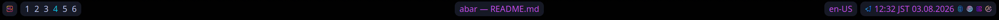

# abar

Minimalistic Wayland-native status bar using Cairo + Pango, inspired by ashell/waybar.



## Requirements

**Build dependencies:**

- Rust toolchain
- `libcairo2-dev` / `cairo`
- `libpango1.0-dev` / `pango`
- `libwayland-dev` / `wayland`
- A FreeDesktop icon theme (e.g. `hicolor`, `candy-icons`)

## Features

| Feature      | Description                                                                          |
| ------------ | ------------------------------------------------------------------------------------ |
| `clock`      | Clock module with format rotation and timezone cycling.                              |
| `keyboard`   | Keyboard layout module driven by an exec script.                                     |
| `workspaces` | Workspace list module driven by an exec script.                                      |
| `window`     | Active window title module driven by an exec script.                                 |
| `mpris`      | Media player info module driven by an exec script.                                   |
| `tray`       | SNI system tray via [`trayd`](https://github.com/Gigas002/trayd) and an exec script. |
| `svg`        | SVG icon support (requires `resvg`; PNG-only without this flag).                     |

No features are enabled by default.

## Configuration

abar follows XDG conventions:

| Path                                       | Description                                                           |
| ------------------------------------------ | --------------------------------------------------------------------- |
| `$XDG_CONFIG_HOME/abar/config.toml`        | Bar layout and module config (default: `~/.config/abar/config.toml`). |
| `$XDG_CONFIG_HOME/abar/themes/<name>.toml` | Theme file referenced by `theme` key in config.                       |
| `$XDG_CONFIG_HOME/abar/scripts/`           | Recommended location for exec scripts.                                |

See [`examples/config.toml`](examples/config.toml) and
[`examples/theme.toml`](examples/theme.toml) for annotated reference configs.

## Exec script contract

All exec-handler modules (`keyboard`, `workspaces`, `window`, `mpris`, `tray`)
are driven by user scripts. See [`docs/EXEC.md`](docs/EXEC.md) for the full
JSON contract, field reference, and script lifecycle documentation.

## Icon theme

Custom modules and tray items use FreeDesktop icon names. abar reads the
`XDG_ICON_THEME` environment variable to select which theme to search (PNG
preferred, SVG supported via the `svg` feature).

```sh
export XDG_ICON_THEME=candy-icons
```

If `XDG_ICON_THEME` is unset, abar falls back to `hicolor`. Theme inheritance
chains defined in `index.theme` are **not** followed — set the theme that
directly contains your icons.

Icons that cannot be resolved are displayed as text (the module name) with a
warning logged.
